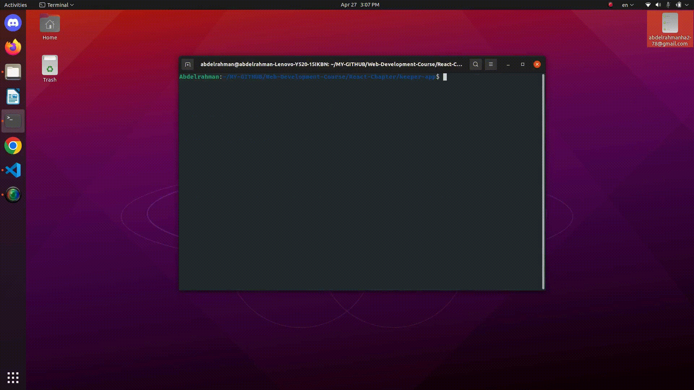

# Note-Keeper-App

### App holds your daily notes and supports adding or deleting notes, provides handling of entered data by giving alert if title or content of note is empty.

> This app is build with React framework
> Icons are used from material icon module

<hr>

### To run the App

```
npm install
npm run

```

<hr>

### App Demo:


